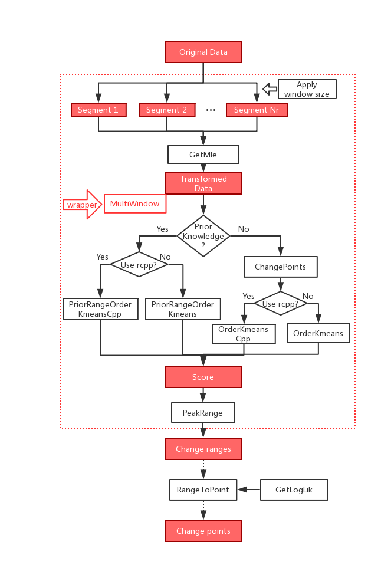

```{r setup, include=FALSE}
knitr::opts_chunk$set(echo = TRUE)
```


# Introduction

This vignette serves as a quick guide on how to use the 'offlineChange' R package to detect multiple change points from offline data, based on the multi-window change point algorithm[@ref1] proposed by Ding et al.

Given a sequence of one-dimensional data $y_1,y_2...y_N$ that may or may not be dependent, the goal is to find change points $0 < l_1 < ...<l_m<N$ where distribution changes occur. A sequence of window sizes $w_1 > ... > w_R$, which are appropriately chosen, can be used to divide the original data into segments of smaller sizes. With the transformation method, these small segments are turned into a sequence of $L + 1$ dimensional data that can be approximated as independent sequences with changes in mean. Then the change points of independent data can be detected by minimizing the sum of loss function and penalty function
\begin{equation}
 \sum_{k=1}^{M+1} Loss(y_{l_{k-1}+1},...,y_{l_k})+penalty.
\end{equation}
By further mapping these change points back to the original scale, several short ranges that possibly contain the desired change points are obtained. After repeating the above procedure for each window size, the detected ranges of change points from each window size are scored by one. The scores are aggregated, and the ranges with highest score or around the highest score finally selected. The selected range is usually a narrow peak range that can be directly used for interpretation or further detection  purposes.

# Installation

The most recent version of this package can be installed from CRAN:
```{r eval=FALSE}
install.packages("offlineChange")
```

This package can also be installed from github:
```{r eval=FALSE}
# First install the devtools package

install.packages("devtools")
library("devtools")

# Then install this package

install_github('JieGroup/offlineChange')
```

# Design

```{r flowchart, echo=FALSE, out.width='100%', fig.align='center', fig.cap='Flow chart of change points detection'}

```

Figure \ref{fig:flowchart} is the flow chart of the implementation of change points detection algorithm. Based on specific situations of data or model (in each segment),  several usage options are available to users.

# Features
## Detect change points of dependent data without prior knowledge on the ranges of changes or the number of change

Suppose there is a sequence of one-dimentional dependent data, and the true number of change points is unknown, then the following function can be used to return the ranges that are most likely to contain the true change points. A list of window sizes *window_list* is specified by the user. Each window size should be less than the number of observations. The purpose of these windows, as explained in the reference paper, are used to divide the original data into segments so that the data can be transformed. The largest number of changes *point_max* should be specified by the user as well. 

```{r, echo=FALSE}
set.seed(5701)
library(offlineChange)
```

```{r, cache=TRUE}
# Create AR(2) data y with 1000 observations that have 2 change points: 100, 400
N <- 1000
N1 <- floor(0.1*N)
N2 <- floor(0.3*N)
a1 <- c(0.8, -0.3); c1 <- 0
a2 <- c(-0.5, 0.1); c2 <- 0
a3 <- c(0.5, -0.5); c3 <- 0
y <- rep(0,N)
L<-2
y[1:L] <- rnorm(L)
for (n in (L+1):N){
  if (n <= N1) {
    y[n] <- y[(n-1):(n-L)] %*% a1 + c1 + rnorm(1)
  } else if (n <= (N1+N2)) {
    y[n] <- y[(n-1):(n-L)] %*% a2 + c2 + rnorm(1)
  }
  else {
    y[n] <- y[(n-1):(n-L)] %*% a3 + c3 + rnorm(1)
  }
}
# Detect change points of y using window size 100, 50, 20, 10, 5 respectively
result <- MultiWindow(y,
                      window_list = c(100,50,20,10,5),
                      point_max   = 3)
```
The returned results contain the number of peak ranges and location of peak ranges:
```{r, cache=TRUE}
result$n_peak_range # number of peak ranges
result$peak_range # ranges that contain change points
```

## Modify default arguments
The users can also modify some other default arguments:
```{r eval=FALSE}
result <- MultiWindow(# The original data to find change points.
                      y,    
                      # The list of window sizes
                      window_list = c(100, 50, 20, 10, 5),  
                      # The largest candidate number of change points.
                      point_max   = 5,    
                      # The prior ranges that considered to contain change points.
                      prior_range = NULL,  
                      # The method used to transform dependent data to independent data.
                      get_mle     = GetMle,   
                      # Penalty type term. Default is "bic". 
                      # Users can use other penalty term.
                      penalty     = c("bic","aic","bc"),  
                      # Minimal segment size between change points at transformed sacle.
                      seg_min     = 1,   
                      # The number of repetition times, in order to avoid local minimum.
                      num_init    = NULL,  
                      # The tolerance level. The maximal difference between the 
                      # score of selected peak ranges and highest score.
                      tolerance   = 1,    
                      # Logical value indicating whether to accelerate using rcpp. 
                      # Default is TRUE
                      cpp         = TRUE,   
                      # Logical value indicating whether to return score. Default is FALSE.
                      ret_score   = FALSE                   
                      )
```
The argument *cpp* indicates whether to increase computation speed using rcpp. 

## Get exact change points

Based on the peak ranges returned, users can use the following function to get exact change points:
```{r, eval=FALSE}
result <- MultiWindow(y,
                      window_list = c(100,50,20,10,5),
                      point_max   = 3)
```

```{r,cache=TRUE}
# Get change points according peak ranges
RangeToPoint(y,
             n_peak_range = result$n_peak_range,
             peak_range   = result$peak_range)
```

## Plot score
Users can plot the score that represents how likely the range contains change points. The higher score a range has, the more likely the range contains change point. The argument *ret_score* must be TRUE in order to get score plot.
```{r}
result <- MultiWindow(y,
                      window_list = c(100,50,20,10,5),
                      point_max   = 3,
                      ret_score=TRUE)
```

```{r, eval=FALSE}
ScorePlot(result, main="score plot")
```
Figure \ref{fig:comparison} is the comparison of original data y and score plot. And the true change points are 100 and 400.

```{r comparison, echo=FALSE, out.height='50%', fig.width=10, fig.align='center', fig.cap="Comparison of original data y and score plot", fig.subcap=c("Original data y","Score plot")}
knitr::include_graphics(c('scoreplot.png', 'original_y.png'))
```

## Plot peak ranges in original data
Based on the peak ranges returned, users can also plot them on original data. In figure \ref{fig:peakrange}, blue line and red line represent the start and end of a peak range. (The true change points are 100 and 400.)
```{r, eval=FALSE}
result <- MultiWindow(y,
                      window_list = c(100,50,20,10,5),
                      point_max   = 3)
```

```{r peakrange, fig.align='center', fig.width=7, fig.cap = "Original data y and peak ranges"}
# peak ranges in original data
ChangePointsPlot(y, result, main="plot of change points of y")
```

## Define your own transformation function with argument get_mle
The default transformation method from dependent data to independent data is OLS estimation of AR coefficients. Users can define their own transformation functions with aregument *get_mle*. It is chosen to be the function that will calculate estimates of unknown parameters assuming that the data is generated from a parametric family. Below is the own defined data transformation function *GetHle*:
```{r, results='hide'}
library('MHadaptive')
```

```{r include=FALSE}
set.seed(3)
```

```{r}
# Create simulation data X with 1000 observations with true change points 200 and 500
gen_EFdata <- function(N){
  q <- 4
  Ns <- c(floor(0.2*N), floor(0.3*N), N-floor(0.2*N)-floor(0.3*N))
  thetas <- c(0.2,0.6,1)
  X <- c()
  for (k in 1:3){
    loglik <- function( x ){ 
      res <- - thetas[k] * abs(x)^q
    }
    mh <- Metro_Hastings(loglik, 
                         rgamma(n = 1, shape = 3, rate = 1), 
                         prop_sigma = NULL,
                         par_names = NULL, 
                         iterations = 11000, 
                         burn_in = 1000,
                         adapt_par = c(100, 20, 0.5, 0.75), 
                         quiet = TRUE)
    mh0 <-  mcmc_thin(mh, thin = 20)
    X <- c(X, mh0$trace[1:Ns[k]])
  }
  return(X)
}
N <- 1000
X <- gen_EFdata(N)

# Create custom transformation method
GetHle=function(x,window_size) {
  q <- 4
  N <- length(x)
  n_window <- ceiling(N/window_size)
  x_transformed <- rep(0,n_window)
  for (n in 1:n_window) {
    #get estimated coefficients  
    xx <- x[(1+(n-1)*window_size):min(n*window_size,N)]
    x_transformed[n] <- q * (q-1) * sum(abs(xx)^(q-2)) / sum(q^2 * abs(xx)^(2*q-2))
  }
  return(x_transformed)
}

# Get peak ranges
result <- MultiWindow(X,
                      window_list=c(100,80,50,30, 20),
                      get_mle=GetHle,
                      point_max=2,
                      seg_min=1,
                      tolerance=1,
                      ret_score = TRUE)
```
The score plot of y is figure \ref{fig:scoreplot2}.
```{r scoreplot2, fig.align='center', fig.width=7}
# Plot score plot
ScorePlot(result, main="score plot of simulation data")
```
The peak ranges of original data y is in figure \ref{fig:peakrange2}.
```{r peakrange2, fig.align='center', fig.width=7, fig.cap = "Original data X and peak ranges"}
ChangePointsPlot(X, result, main="plot of change points of X")
```

## Define your own penalty term with argument penalty
Besides transformation function, users can also define peanlty terms they like. Be careful that, the penalty function is actually the sum of loss and penalty.
```{r}
# Create custom penalty
toy_penalty <- function(num_each, wgss, D, K, N) {
  penalty <- sum(num_each * log(wgss/num_each)) + 2 * D * K * log(N)
  return(penalty)
}

result <- MultiWindow(y,
                      window_list=c(100,50,20,10,5), 
                      penalty="toy_penalty", 
                      point_max=3,
                      seg_min=1,
                      tolerance=1)
result$peak_range
```

## Detect change points of dependent data with prior change ranges

Suppose there is a sequence of one-dimentional dependent data, and the user already know prior ranges that change points should be within. Then the following function can be used to return the (narrower) ranges that are most likely to contain the true change points, with much less computational cost compared with the previous method. 
```{r}
# Detect change points with prior change ranges (30,200) and (220,400)
result <- MultiWindow(y,
                      window_list = c(100,50,20,10,5),
                      prior_range = list(c(30,200),c(220,400)))
result$peak_range
```

## Detect change points of independent data without prior ranges and true number of change points

Suppose there is a sequence of independent data with dimension L+1, and the true number of change points is unknown, then the following function can be used to return the change points. Like before, the largest number of changes *point_max* should be specified by the user. 

```{r}
# Create simulation data x that is independent and has with dimension (100,2)
# The true change points are 20, 80.
a <- matrix(rnorm(40,mean=-1,sd=1), nrow=20, ncol=2)
b <- matrix(rnorm(120,mean=0,sd=1), nrow=60, ncol=2)
c <- matrix(rnorm(40,mean=1,sd=1), nrow=20, ncol=2)
x <- rbind(a,b,c)
# Detect number and locations of change points
result <- ChangePoints(x, point_max = 5)
result$num_change_point
result$change_point
```
And the users can also modify some default arguments:
```{r eval=FALSE}
result <- ChangePoints(x,
                       # The prior ranges that considered to contain change points.
                       point_max = 5,  
                       # Penalty type term. Default is "bic". 
                       # Users can use other penalty term.
                       penalty   = c("bic","aic","bc"), 
                       # Minimal segment size between change points at transformed sacle.
                       seg_min   = 1,
                       # The number of repetition times, in order to avoid local minimum.
                       # Default is squared root of number of observations.
                       num_init  = NULL,
                       # Logical value indicating whether to accelerate using rcpp. 
                       # Default is TRUE
                       cpp       = TRUE)
```

## Detect change points of independent data without prior ranges but with true number of change points

Suppose there is a sequence of independent multivariate data, and the true number of change points is already known, then the following function can be used to return the change points. Here, K is the number of change points instead of the number of segments.

```{r}
# Create simulation data x that is independent and has with dimension (100,2)
# The true change points are 20, 80.
a <- matrix(rnorm(40,mean=-1,sd=1), nrow=20, ncol=2)
b <- matrix(rnorm(120,mean=0,sd=1), nrow=60, ncol=2)
c <- matrix(rnorm(40,mean=1,sd=1), nrow=20, ncol=2)
x <- rbind(a,b,c)
# Detect locations of change points
result <- OrderKmeans(x, K = 2)
result$change_point
```
And the users can also change the suggested setting of arguments:
```{r eval=FALSE}
result <- OrderKmeans(x, K = 2, num_init=10)
```
And with rcpp acceleration, the codes can be:
```{r eval=FALSE}
result <- OrderKmeansCpp(x, K = 2)
```

## Detect change points of independent data with prior change ranges
Suppose there is a sequence of independent multivariate data, and the user already know prior ranges that change points should be within, then the following function can be used to return change points, and the prior knowledge of ranges of change points can make the cumputation more efficient and the return change points more accurate. 
```{r}
# Create simulation data x that is independent and has with dimension (100,2)
# The true change points are 20, 80.
a <- matrix(rnorm(40,mean=-1,sd=1), nrow=20, ncol=2)
b <- matrix(rnorm(120,mean=0,sd=1), nrow=60, ncol=2)
c <- matrix(rnorm(40,mean=1,sd=1), nrow=20, ncol=2)
x <- rbind(a,b,c)
# Set prior ranges that contain change points
l1 <- c(15,25)
l2 <- c(75,100)
prior_range_x <- list(l1, l2)
# Detect locations of change points with prior ranges
result <- PriorRangeOrderKmeans(x, prior_range_x = list(l1,l2))
result
```
And the users can also modify some default arguments:
```{r eval=FALSE}
result <- PriorRangeOrderKmeans(x, prior_range_x, num_init=5)
```
And with rcpp acceleration, the codes can be:
```{r eval=FALSE}
result <- PriorRangeOrderKmeansCpp(x, prior_range_x)
```

# Reference